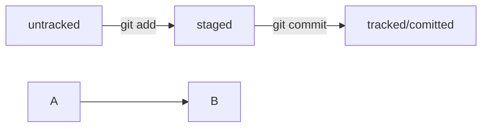

# gittest

### git add
добавляет файлы в индекс
### git commit -m 'message'
фиксирует изменения с указанным сообщением
### git remote add
добавляет удаленный репозиторий в настройки локального репозитория
### git push -u origin main
отправляет изменения на удаленный репозиторий

----
HEAD -- это голова.
Коммит -- это всему голова.

Статусы файлов:
<тут пустая строка!>

<и тут пустая строка!>
